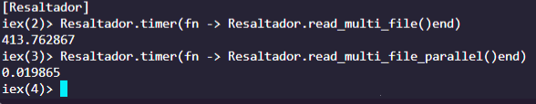
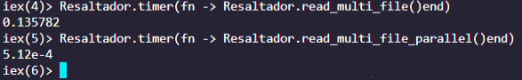
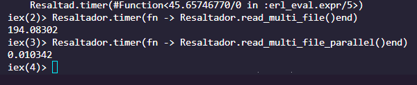

# Actividad Integradora 5.3
Implementación de métodos computacionales (Gpo 600)
## Tabla de contenidos

- [Integrantes del Equipo](#integrantes-del-equipo)
- [Paralelismo vs Secuencial](#paralelismo-vs-secuencial)
- [Complejidad del Algoritmo](#complejidad-del-algoritmo)
- [Conclusión](#conclusión)

## Integrantes del equipo

 - **Iván Díaz Lara** A01365801 
 - **Octavio Fenollosa** A01781042

## Paralelismo vs Secuencial

Para esta segunda entre del resaltador de sintaxis, tuvimos que implementar una nueva funcionalidad, poder leer multiples archivos JSON encontrados dentro de una misma carpeta en una sola ejecucción.

Inicialmente implementamos nuestra solución de manera secuencial, es decir, el programa leia cada archivo de manera individual y lo procesaba uno por uno, lo cual hacía nuestro proyecto un tanto ineficiente.

Por lo tanto decidimos cambiar esta solución por una más eficiente, el paralelismo. Una vez implementando el algoritmo usando paralelismo pudimos ver resultados impresionantes, ya que en lugar de leer archivo por archivo, el programa tuvo acceso al poder de todos los threads disponibles del ordenador para asignar cada uno a un nuevo archivo, y así procesar multiples archivos al mismo tiempo.

Para comprobar la funcionalidad correcta de la nueva solución, hicimos algunas pruebas varíando el tamaño de los archivos jsons y también la cantidad de archivos dentro de la carpeta indicada.

### Large JSON files | 6 samples:

### Small JSON files | 6 samples:

### Large and Small JSON files | 6 small and 3 large samples:

Los resultados nos muestran una mejora impresionante, en promedio el parallelismo fue un 99.9% más rapido a la hora de leer los archivos.

El speedup que obtuvimos fué de 20897.

## Complejidad del Algoritmo

La funcion de Regex.replace() tiene una complejidad O(n), sin embargo nuestro programa ejecuta multiples veces esta función lo que puede llevarnos a tener una complejidad de O(n^2) o incluso más.

Debido a que el paralelismo solamente divide el "runtime" proporcionalmente entre los procesadores, no podemos decir que reducirian la complejidad del algoritmo como tal, es mas una tipo de fuerza bruta que ayuda a incrementar la velocidad de ejecucion de los programas.

## Conclusión

El paralelismo ha demostrado ser una herramienta muy util, sin embargo considero que debería ser usada como ultimo recurso ya que antes de paralelizar nuestro algoritmo se debería intentar optimizar y mejorar para así reducir su complejidad, lo cual puede reducir de manera mas efectiva la complejidad del algoritmo.
